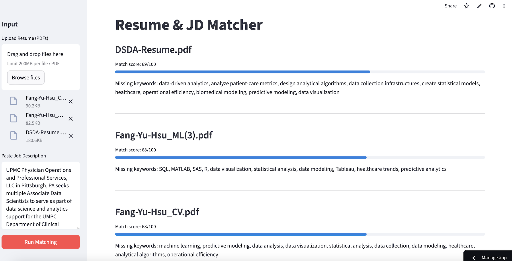

# Resume & JD Matcher



A smart AI-powered system that evaluates how well a resume matches a job description.
The app uses embeddings + LLMs to compute match scores (0–100) and generate actionable missing-keyword suggestions.

**Live App**: https://uchicago-mpcs-57200-1-finalproject-resumejdmatcher.streamlit.app

**Demo Video**: https://youtu.be/bj5eyulUw5Y

**Course**: The University of Chicago – MPCS 57200-1 Generative AI

**Author**: Francy Hsu

## System Architecture
```text
Upload PDF Resumes → Text Extraction → Chunking → Embedding
                      ↓
Paste a Job Description → Canonicalization → Embedding → Similarity
                      ↓
           LLM Grading (Rubric Evaluation)
                      ↓
     Missing Keyword Analysis (Semantic + LLM)
                      ↓
         Final Score + Missing Suggestions
```

## Key Features
1. **Upload Multiple Resumes (PDF)**
- Supports 1–N resume PDFs
- Automatic text extraction & cleaning
- Shows uploaded file list

2. **Paste Job Description Text**
- JD must be pasted (no PDF upload)
- Automatically cleaned and normalized

3. **Embedding-Based Similarity**
- Uses OpenAI text-embedding-3-large
- Cosine similarity measures semantic match
- Chunk-level relevance to improve accuracy

4. **LLM Rubric Scoring**
- GPT evaluates resumes using a calibrated rubric:
  - 90–100 Excellent
  - 80–89 Good
  - 70–79 Decent
  - 60–69 Weak
  - <60 Poor / mismatched
- Final score = weighted combination of:
  - Embedding score
  - LLM rubric score

6. **Missing Keyword Suggestions**
- Extracts canonical skills & responsibilities from JD
- Checks what’s semantically present in resume
- LLM recommends high-impact missing keywords
- Example: “Airflow, A/B testing design, feature engineering”

7. **Clean Streamlit UI**
- Sidebar for inputs
- Progress bars for match scores
- Sorted results by best match
- Easy for recruiters or students to use

## Scoring Method
1. **Embedding Similarity Score (0–100)**
- Compute cosine similarity JD ↔ resume chunks
- Use best-matching chunks
- Convert to 0–100 scale

2. **LLM Rubric Score (0–100)**
```text
Assess: Skills, Tools, Responsibilities, Domain relevance, Education background, Seniority level
```
3. **Final Score**
```text
final_score = 0.6 * llm_score + 0.4 * embedding_score
```

## Technology Stack

| Component | Technology |
|----------|------------|
| Frontend | Streamlit |
| Embeddings | OpenAI `text-embedding-3-large` |
| LLM | GPT-4o-mini |
| PDF Parsing | pypdf |
| Vector Similarity | NumPy |
| Semantic Keyword Detection | Embedding + Cosine Threshold |
| Missing Keyword Suggestions | LLM JSON output |
| Deployment | Streamlit Cloud |

## Project Structure
```text
resume-jd-matcher/
│
├─ app.py                 # Main Streamlit entry point
├─ requirements.txt
│
└─ src/
   ├─ embeddings.py       # Embedding functions
   ├─ pdf_io.py           # PDF extraction + cleaning
   ├─ chunker.py          # Sliding window chunk creation
   ├─ match_utils.py      # Cosine similarity, scoring helpers
   ├─ grader.py           # LLM rubric scoring
   ├─ keywords.py         # JD canonicalization + keyword coverage
   └─ missing.py          # LLM missing keyword generator
```

## Installation (Local)
1. **Clone the repo**
```bash
git clone https://github.com/<your-username>/resume-jd-matcher.git
cd resume-jd-matcher
```
2. **Install dependencies**
```bash
pip install -r requirements.txt
```
3. **Add your OpenAI API key**
```bash
export OPENAI_API_KEY="sk-xxxx"
```
4. **Run the app**
```bash
streamlit run app.py
```

## Source
Some resume samples in the demo video are from https://www.shu.edu/documents/Resume-Samples.pdf.

